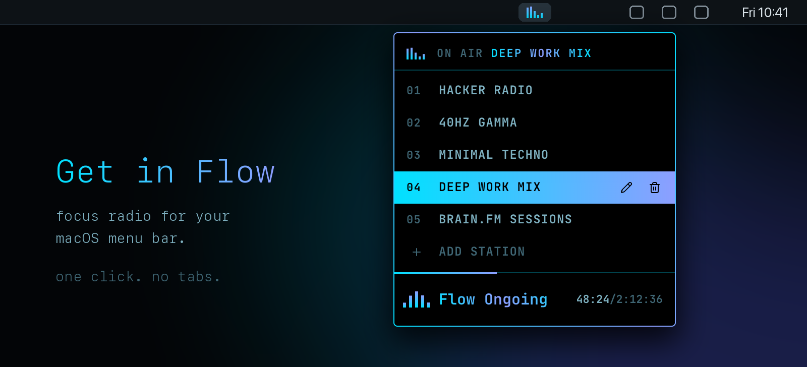

<p align="center">
  
</p>

<h1 align="center">Flow Radio</h1>

<p align="center">
  <b>Deep-work music one click away, in your menu bar.</b><br>
  No browser tab to lose, no autoplaying video, no account. Click the equalizer and get in flow.
</p>

<p align="center">
  <a href="https://github.com/onflow-studio/radio-flow/releases/latest"><b>Download for macOS (Apple Silicon)</b></a>
  ·
  <a href="#build-it-yourself">Build from source</a>
</p>

---

## Why

Focus music lives in a YouTube tab. The tab gets closed, buried under forty others, or turns into "just one video". Flow Radio puts the music somewhere it can't distract you: a tiny equalizer in the menu bar. The panel opens, you pick a station, it closes and stays out of your way.

## What you get

- **Five stations, ready to go.** Hacker radio (live), 40hz gamma, minimal techno, a deep work mix and brain.fm sessions.
- **Add your own.** Paste any YouTube video, live stream or playlist link. Flow Radio names the station from the video's title.
- **Picks up where you left off.** Each station remembers its spot, even after you quit or restart. Playlists keep their shuffled order.
- **Always know where you are.** The play bar shows elapsed time and length, or `LIVE` for streams, with a progress line glowing along its edge.
- **An icon that shows what's on.** The equalizer holds still when stopped and bounces while music plays, so you can tell at a glance.
- **Keyboard first.** Arrows to move, enter to play, `e` to rename, delete to remove, esc to close.
- **Careful edits.** Renames and removals ask before they happen.
- **Quiet by design.** Nothing touches YouTube until you press play. No dock icon, no window, no telemetry.

## Install

1. Download `Flow.Radio-*-arm64-mac.zip` from the [latest release](https://github.com/onflow-studio/radio-flow/releases/latest) and unzip it.
2. Move **Flow Radio.app** to `/Applications`.
3. The app isn't notarized by Apple, so macOS blocks the first launch. Clear the download flag once:

   ```sh
   xattr -dr com.apple.quarantine "/Applications/Flow Radio.app"
   ```

4. Open it. The equalizer appears in your menu bar. Right-click it and tick **Open at Login** to keep it there.

## Use

| Do this | To |
| --- | --- |
| Click the equalizer | Open or close the station panel |
| Click a station, or ↑ ↓ then enter | Tune in |
| Click **Get in Flow** / **Flow Ongoing**, or enter | Play or pause |
| **+ add station**, paste a link, enter | Add a station |
| Hover a station, then ✎ or `e` | Rename it (asks first) |
| Hover a station, then 🗑 or delete | Remove it (asks first) |
| esc, or click anywhere else | Close the panel. Music keeps playing |
| Right-click the equalizer | Play/pause, Open at Login, Quit |

## How it works

Flow Radio is a small Electron app. The panel is a React page in a frameless window that only ever hides, so the music keeps playing while it's closed. Audio comes from the official YouTube IFrame player, kept in a hidden 1px box inside that window. YouTube's ads, terms and creators all stay in the loop.

Your stations and the spot each one stopped at are saved to `~/Library/Application Support/Flow Radio/store.json`. That file is the only thing it stores, and it never leaves your Mac.

## Build it yourself

Needs Node 22+ and pnpm.

```sh
git clone https://github.com/onflow-studio/radio-flow.git
cd radio-flow
pnpm install
pnpm start          # build the panel and launch from source
pnpm install-app    # package and copy to /Applications/Flow Radio.app
pnpm release        # package a distributable zip into release/
```

To change the five starting stations, edit `DEFAULT_STATIONS` in [`renderer/src/radio.tsx`](renderer/src/radio.tsx). Stations you add in the app are saved on top of these.

## Origin

Flow Radio started as the radio built into the status line of email-flow, a personal mail client. It got so much use that it moved out to the menu bar to play alongside everything else.

## License

[MIT](LICENSE)
